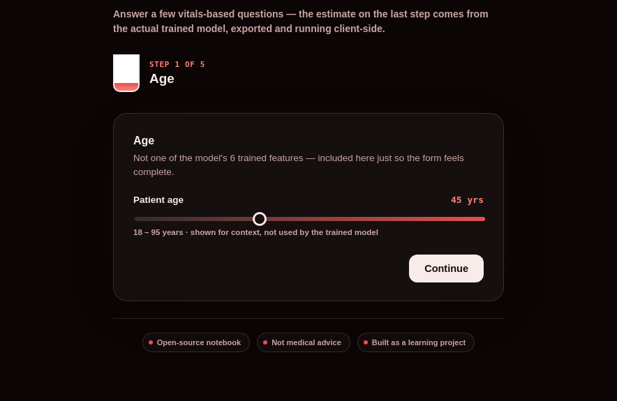
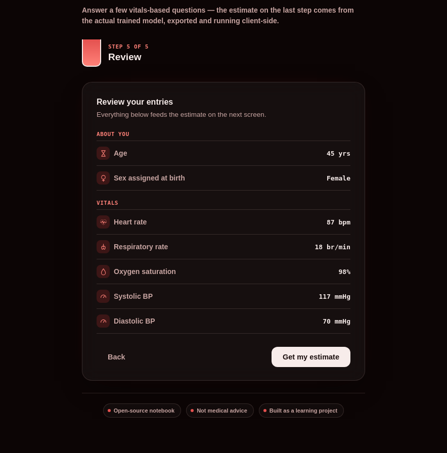
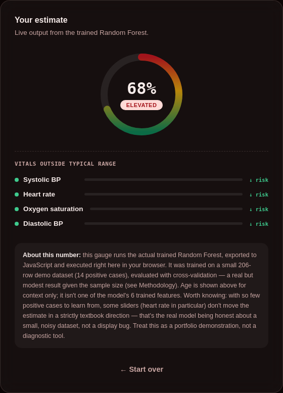

<div align="center">


# Transfusion Risk Prediction

**A small-data ML pipeline predicting blood transfusion need from routine patient vitals — built, debugged, and evaluated in the open.**


[Live Demo](#interactive-demo) · [Notebook](#project-structure) · [Key Findings](#key-findings) · [Methodology](#methodology)

</div>

---

## Overview

This project predicts whether a patient stay involved a transfusion need, using 6 routine clinical vitals — heart rate, respiratory rate, oxygen saturation, systolic/diastolic blood pressure, and sex. It's built on a small MIMIC-style demo dataset (206 patient stays, 14 positive cases).

**What makes this project worth a look isn't a headline accuracy number — it's the debugging journey.** Two rounds of data leakage were found and fixed, a database join-explosion bug was traced and corrected, a reproducibility bug was caught, and every result is reported with honest uncertainty (cross-validated mean ± standard deviation) rather than a single cherry-picked score.

**Try it live:** `transfusion_dashboard.html` — a wizard-style risk checker running the *actual* trained model client-side, no server required.

---

## Dataset

| Attribute | Value |
|---|---|
| Total rows (patient stays) | 206 |
| Positive cases (`needs_transfusion = 1`) | 14 (~6.8%) |
| Negative cases | 192 (~93.2%) |
| Features used in final model | 6 |
| Source tables | `patients`, `vital`, `lab_result` |
| Database | MySQL (`BloodMatching`) |

<details>
<summary><b>Features used</b></summary>
<br>

| Feature | Description | Type |
|---|---|---|
| `Gender` | Patient sex, label-encoded | Categorical |
| `heart_rate_mean` | Mean heart rate across the stay | Continuous |
| `resprate_mean` | Mean respiratory rate across the stay | Continuous |
| `o2sat_mean` | Mean oxygen saturation across the stay | Continuous |
| `sbp_mean` | Mean systolic blood pressure across the stay | Continuous |
| `dbp_mean` | Mean diastolic blood pressure across the stay | Continuous |

**Excluded (label-defining) columns:** `hemoglobin`, `sbp_min`, `heart_rate_max`, `shock_index_mean`, `pulse_pressure_mean` — directly used in, or derived from, the label formula (see [Key Findings](#key-findings)).

</details>

> **Target label:** `needs_transfusion` is a rule-derived synthetic label (`hemoglobin < 7.5 OR (sbp_min < 90 AND heart_rate_max > 100)`) — a demo construct, not a real clinical transfusion-order event.

---

## Methodology

```
Ingestion  →  Cleaning & Aggregation  →  Leakage-Safe Feature Selection
    →  SMOTE-Balanced Cross-Validation  →  Threshold & Calibration  →  Client-Side Deployment
```

| Step | What was done |
|---|---|
| **1. Ingestion** | Patients, vitals, and lab data loaded into MySQL via SQLAlchemy; credentials via `.env` |
| **2. Cleaning & aggregation** | Vitals aggregated to one row per stay; numeric coercion, sentinel-value handling, median imputation |
| **3. Feature selection** | Label-defining columns and their derivatives excluded from `X` |
| **4. Imbalance handling** | SMOTE applied *inside* each CV fold via `imblearn.Pipeline` — never on the full dataset beforehand |
| **5. Model comparison** | Random Forest vs. Logistic Regression, stratified 5-fold cross-validation |
| **6. Threshold & calibration** | Precision-recall curve for threshold choice; calibration curve for probability trustworthiness |
| **7. Deployment** | Final model refit on full data, exported via `m2cgen`, runs entirely client-side |

### Results

| Model | Mean ROC-AUC | Std | Notes |
|---|:---:|:---:|---|
| **Random Forest** (+ SMOTE) | 0.791 | 0.064 | Tight, consistent fold performance |
| **Logistic Regression** (+ SMOTE) | 0.812 | 0.178 | Slightly higher mean, but far noisier fold-to-fold |

Both models were evaluated on the *same* 5 stratified folds. Given the small sample size, the difference between them is not statistically decisive — reported honestly as a comparison, not a declared winner.

---

## Key Findings

| # | Finding | Impact |
|---|---|---|
| 1 | **Label leakage — found and fixed twice.** Once as a pandas formula built from model features, then discovered baked into the SQL view itself after the first fix | Both produced a meaningless perfect ROC-AUC of 1.0 until corrected |
| 2 | **Database join-explosion bug.** Two one-to-many tables joined without a shared row key | Inflated 222 patients into 2M+ rows before being caught |
| 3 | **Reproducibility bug.** Unseeded random hemoglobin generator | Dataset labels silently changed on every re-run until fixed |
| 4 | **Logistic Regression matched/slightly outperformed Random Forest** in cross-validation | Legitimate small-data finding — simpler models can generalize better with limited data |
| 5 | **The real model shows non-monotonic behavior on heart rate** | Genuine evidence of small-sample overfitting, disclosed openly in the interactive demo rather than hidden |

---

## Limitations

- **Sample size.** 206 patient stays and 14 positive cases is small — all metrics here are indicative, not definitive.
- **Synthetic label.** `needs_transfusion` is rule-derived for this demo, not a real clinical outcome. This project demonstrates leakage-aware, honestly evaluated ML methodology — not a validated clinical tool.
- **No additional real data was available** for this iteration; a larger patient sample would improve reliability more than further modeling changes.
- **Age** is collected in the interactive demo for context but is not one of the model's trained features.

---

## Interactive Demo

`transfusion_dashboard.html` is a self-contained, single-file web app — no build step, no server, no API. Open it directly in any browser.

- 5-step guided wizard (age, sex, heart/breathing rate, oxygen/blood pressure, review)
- Runs the **actual trained Random Forest**, exported to JavaScript via `m2cgen` and executed client-side
- Shows which vitals are outside typical range alongside the model's live probability output
- Openly discloses the model's known quirks (e.g. the non-monotonic heart rate behavior) rather than hiding them

<table>
<tr>
<td align="center" width="33%"><br><sub>Step 1 of 5 — guided input</sub></td>
<td align="center" width="33%"><br><sub>Review before estimating</sub></td>
<td align="center" width="33%"><br><sub>Live output from the real model</sub></td>
</tr>
</table>

---

## Project Structure

```
├── Pred_Analytics_for_Transfusion.ipynb   # Full pipeline: cleaning, EDA, modeling, evaluation
├── transfusion_dashboard.html             # Interactive demo — runs the real trained model
├── model.js                               # Trained Random Forest, exported via m2cgen
├── drop_heartbeat.gif                      # Pixel-art animation used in this README
├── demo_step1.png, demo_review.png, demo_results.png   # Screenshots of the interactive demo
├── requirements.txt                       # Python dependencies
├── .env                                   # DB credentials (not committed — see .gitignore)
├── .gitignore
└── README.md
```

---

## Running It Yourself

```bash
# 1. Clone and set up environment
conda create -n transfusion-env python=3.11
conda activate transfusion-env
pip install -r requirements.txt

# 2. Add your database credentials
echo "DB_HOST=localhost
DB_USER=root
DB_PASSWORD=your_password
DB_NAME=BloodMatching" > .env

# 3. Run the notebook top to bottom
jupyter notebook Pred_Analytics_for_Transfusion.ipynb
```

Then open `transfusion_dashboard.html` directly in a browser — or serve the repo via GitHub Pages for a shareable live link.

---

<div align="center">

*Portfolio project. Not medical advice.*

</div>
